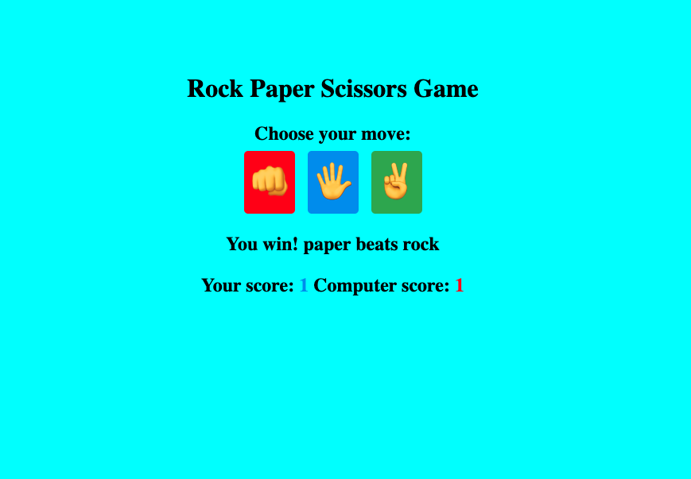

# 🪨 Rock Paper Scissors Game 🎮

A simple Rock-Paper-Scissors game built using **HTML**, **CSS**, and **JavaScript**. This is designed to help reinforce fundamental web development skills like DOM manipulation, event handling, and basic game logic.

---

> 🎯 Inspired by [sahandghavidel](https://github.com/sahandghavidel)'s awesome beginner-friendly projects:  
> https://github.com/sahandghavidel/HTML-CSS-JavaScript-projects-for-beginners  
>  
> All credit goes to Sahand Ghavidel for the original structure and concept. I used this as a hands-on practice project and added some personal touches along the way.

---

## 📸 Demo

---

## 🚀 Features
- 🎮 Classic Rock-Paper-Scissors gameplay
- 🧠 Basic AI for computer choice
- ✨ Simple, clean UI with basic styling
- 🔁 Score tracker that resets with each refresh

---

## 🛠️ Built With
- HTML5
- CSS3
- JavaScript (ES6)

---

## 🧪 How to Run the Project
1. **Clone the Repository**

   ``bash
   git clone [https://github.com/markumed1/rock-paper-scissors-game-mini-project/](https://github.com/markumed1/rock-paper-scissors-game-mini-project)

2. Navigate to the Project Folder
cd rock-paper-scissors-game-mini-project

3. Open index.html in your Browser
   Just double-click the index.html file or use a live server if you're using VS code.

---

🙏 Credits
Big thanks to [Sahand Ghavidel](https://github.com/sahandghavidel) for the original idea and source project. This version was made for learning and practice purposes.

---

